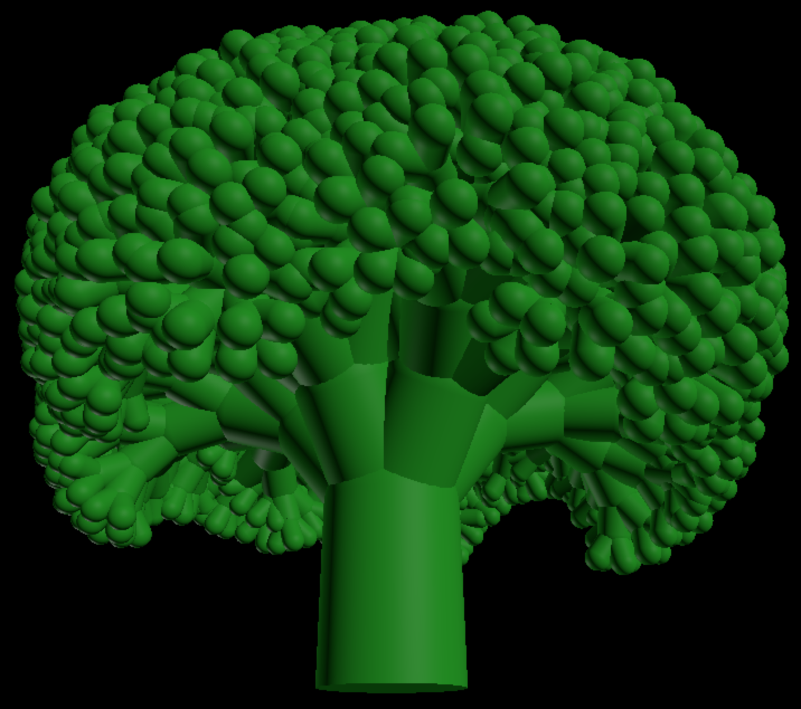

# Broccoli Fractal Generator 🥦

This is an interactive 3D visualization of a self-similar fractal 
inspired by the structure of a Romanesco broccoli. 
The project is built with **TypeScript**, **Three.js**, and **Vite**, 
and is automatically deployed to GitHub Pages using **GitHub Actions**.



Check out the **[live interactive demo](https://owahlen.github.io/broccoli/)** 
to see the fractal in action!

***

### Features ✨

* **Interactive 3D Visualization**: Explore a generated fractal in your browser.
* **Self-Similar Structures**: The object is created using a recursive algorithm that builds upon a simple cylinder-and-sphere base.
* **TypeScript**: The project is written in TypeScript for type safety and better code organization.
* **Vite**: Uses Vite for a fast and efficient development environment with hot module reloading.
* **Automated Deployment**: A GitHub Actions workflow automatically builds and deploys the project to GitHub Pages on every push to the `main` branch.

***

### How It Works 🛠️

The fractal is generated by a recursive function that follows a simple rule:
1.  A parent cylinder-and-sphere segment is created.
2.  From the sphere, 4 to 6 smaller cylinders are attached.
3.  These new cylinders are evenly distributed on a circle orthogonal to the parent cylinder's axis.
4.  Each new cylinder is angled between 30 and 40 degrees relative to the parent's axis.
5.  This process is repeated for each new cylinder, with the new segments getting progressively smaller, creating the fractal's characteristic, broccoli-like appearance.

The scene itself uses two `DirectionalLight` sources to provide realistic lighting from opposite sides, and an `Object3D` pivot allows for smooth, mouse-controlled rotation of the entire structure.

***

### Getting Started 🚀

To run this project locally, follow these steps:

1.  **Clone the repository:**
    ```sh
    git clone [https://github.com/owahlen/broccoli.git](https://github.com/owahlen/broccoli.git)
    ```
2.  **Navigate to the project directory:**
    ```sh
    cd broccoli
    ```
3.  **Install dependencies:**
    ```sh
    npm install
    ```
4.  **Start the development server:**
    ```sh
    npm run dev
    ```
    Your project will now be running on `http://localhost:5173`. Any changes you make to the code will automatically reload the page.

***

### License 📝

This project is licensed under the MIT License - see the `LICENSE` file for details.
